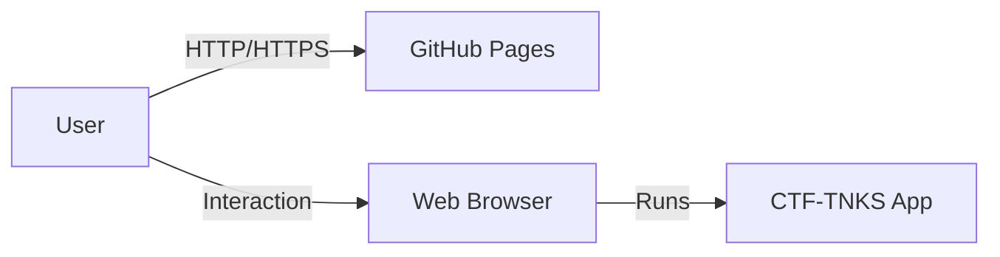

# 3. System Scope and Context

## 3.1 Business Context

CTF-TNKS operates as a standalone web application. Users interact with it directly via their browser. There are no external servers for game state (currently), user accounts, or persistent storage beyond local browser storage (if used for settings).

**Inputs:**

- Keyboard (Arrow keys, Space, etc.)
- Mouse (UI interaction)

**Outputs:**

- Canvas rendering (Visuals)
- Audio (Sound effects, Music)

## 3.2 Technical Context

The application is a purely client-side Single Page Application (SPA).
