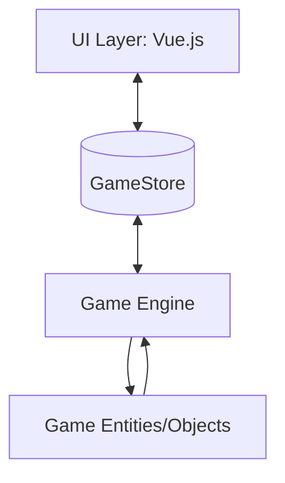
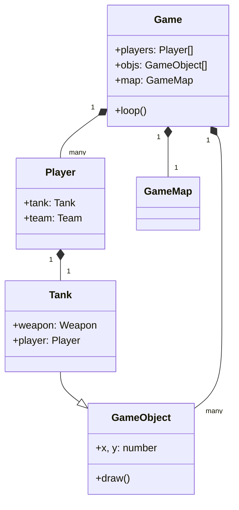

# Building Block View

## Level 1: White Box Overall System

The system is divided into three main layers:

1. **UI Layer (Vue.js)**: Manages menus, settings, and the game HUD.
2. **Game Engine (TS)**: Manages the game loop, map generation, and collision detection.
3. **Game Entities/Objects (TS)**: Defines the behavior of Tanks, Bullets, Power-ups, and Weapons.

### Key Components

- `Game`: The central controller for a match.
- `GameMap`: Handles the grid, tiles, and spatial partitioning for objects.
- `Tank`: The primary actor, composed of a `Weapon` and controlled by a `Player` (Human or Bot).
- `Bot`: AI logic for controlling tanks.
