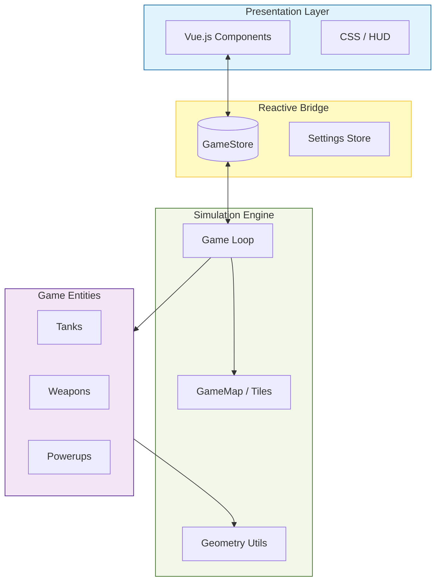
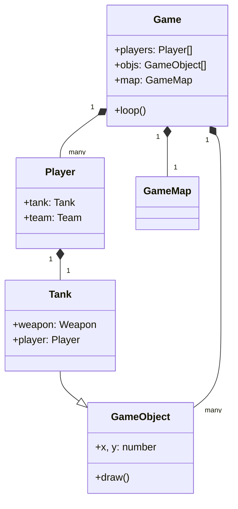

# Building Block View

## Level 1: White Box Overall System

The system is divided into three main layers, clearly separated by their responsibility and technology:

1.  **Presentation Layer (Blue)**: Purely visual. It reacts to changes in the Store and triggers commands (like "Start Game").
2.  **Reactive Bridge (Yellow)**: The single source of truth for the UI. It holds the "current state" of players and settings.
3.  **Simulation Engine (Green)**: The math-heavy core. It runs at a fixed frequency and drives the logic.
4.  **Game Entities (Purple)**: The "Actors" within the simulation. They hold the behavior for specific game elements.

### Key Components

- `Game`: The central controller for a match.
- `GameMap`: Handles the grid, tiles, and spatial partitioning for objects.
- `Tank`: The primary actor, composed of a `Weapon` and controlled by a `Player` (Human or Bot).
- `Bot`: AI logic for controlling tanks via the `Autopilot` strategy.
