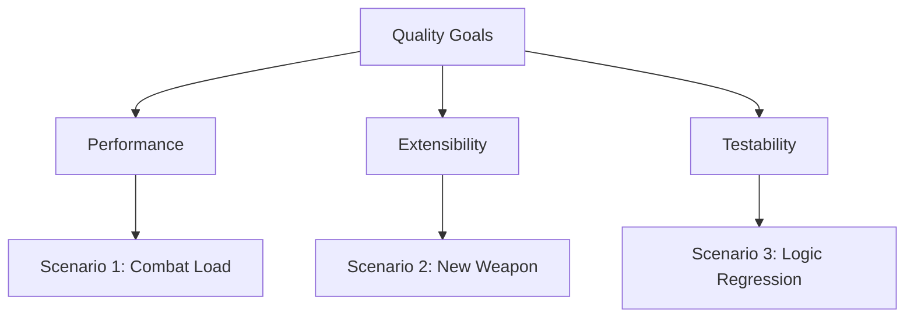

# Quality Requirements

This section defines the quality goals and specifies them through concrete quality scenarios.

## Top Quality Goals

1. **Performance**: The game must remain fluid and responsive even during high-intensity combat.
2. **Extensibility**: The effort to add new game content (weapons, power-ups) must be kept to a minimum.
3. **Testability**: Core logic must be verifiable in an automated fashion to prevent regressions.

## Quality Tree

## Quality Scenarios

### Scenario 1: Performance under Combat Load

- **Stimulus**: 8 tanks are active on a large map, and more than 50 bullets/particles are being processed simultaneously.
- **Context**: Normal gameplay in a modern browser.
- **Response**: The game engine completes the logic step and rendering within the frame budget.
- **Measure**: Frame rate remains at a stable 60 FPS (frame time < 16.6ms).

### Scenario 2: Adding a New Weapon Type

- **Stimulus**: A developer wants to add a new weapon with unique behavior (e.g., a "Flamethrower").
- **Context**: Development phase.
- **Response**: The developer only needs to implement a new subclass of `Weapon` and register it in a single configuration point.
- **Measure**: No modifications to the core `Game` or `Tank` classes are required. Implementation and registration take less than 1 hour for an experienced developer.

### Scenario 3: Verifying Physics Logic

- **Stimulus**: A change is made to the core collision detection or movement logic.
- **Context**: Continuous Integration (CI).
- **Response**: Automated unit tests verify the math and behavior without requiring a browser environment or manual testing.
- **Measure**: 100% of core physics/geometry utility tests pass within the CI pipeline in less than 30 seconds.
