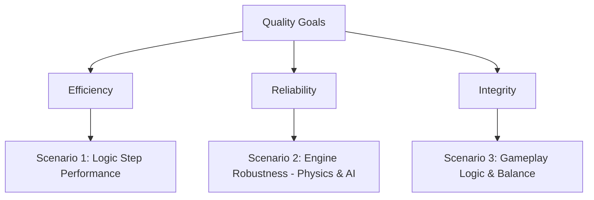

# Quality Requirements

This section defines the core quality goals, focusing on aspects that are verifiable via automated unit and performance tests.

## Top Quality Goals

1. **Efficiency**: The simulation logic must remain fast enough to allow 60 FPS rendering.
2. **Reliability**: Physics and AI pathfinding must behave predictably in complex or high-speed situations.
3. **Integrity**: Gameplay mechanics (like power-ups and feedback triggers) must function according to the design rules.

## Quality Tree

## Quality Scenarios

### Scenario 1: Logic Step Performance (Efficiency)

- **Stimulus**: A combat situation with 8 tanks and 100+ active projectiles.
- **Measure**: The average execution time of the `game.step()` function must be significantly below 16.6ms (target < 2ms) to leave headroom for rendering.
- **Verification**: `tests/performance/stress.test.ts`

### Scenario 2: Engine Robustness (Reliability)

- **Stimulus**: Fast-moving objects hitting corners or bots navigating complex mazes.
- **Measure**:
  - (Physics): Bullets do not tunnel through walls at speeds up to 2000px/s.
  - (AI): The `Autopilot` always selects a target coordinate that reduces the Dijkstra distance to the objective.
- **Verification**: `tests/quality/robustness.test.ts`, `tests/quality/ai_stability.test.ts`

### Scenario 3: Gameplay Logic & Balance (Integrity)

- **Stimulus**: A tank collects a power-up or is destroyed.
- **Measure**:
  - (Balance): Power-up effects (e.g., `SpeedBonus`) are reverted exactly after their defined duration.
  - (Feedback): System events (e.g., `kill()`) correctly trigger the necessary UI/Canvas responses (e.g., `shake()`).
- **Verification**: `tests/quality/gameplay.test.ts`
